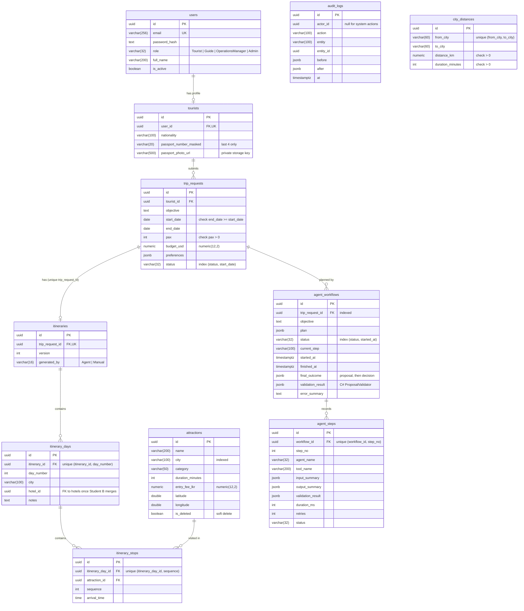

# ER diagram

Generated from the EF Core model (`backend/src/TripCraft.Infrastructure/Persistence/Migrations/AppDbContextModelSnapshot.cs`
and the configurations in `Trips/`, `Identity/`, `Persistence/Auditing/` and `Workflows/`). Every table has `id uuid` (PK),
`created_at` and `updated_at timestamptz`; money is `numeric(12,2)`; column names are snake_case.

Tables of Resource Management (guides, guide_languages, vehicles, hotels, room_types, resource_holds, rate card)
and of Quotations (quotations, quotation_lines, approval_decisions) are designed in PLAN.md section 4 but are
**not in the database yet** — they belong to Students B and C.

**Delete behaviour:** itinerary days and stops cascade with their parent; agent steps cascade with their
workflow; every other foreign key is `RESTRICT`. `audit_logs` has no foreign keys on purpose (it must outlive
the rows it describes).
