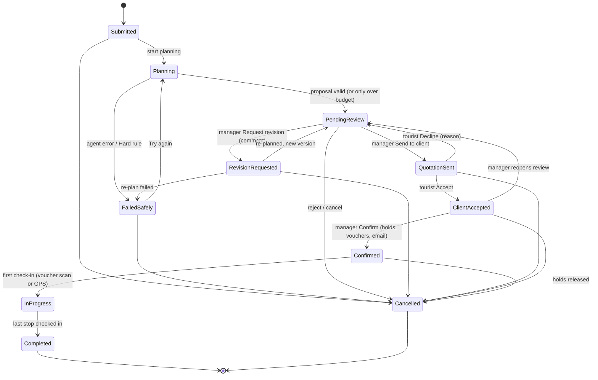
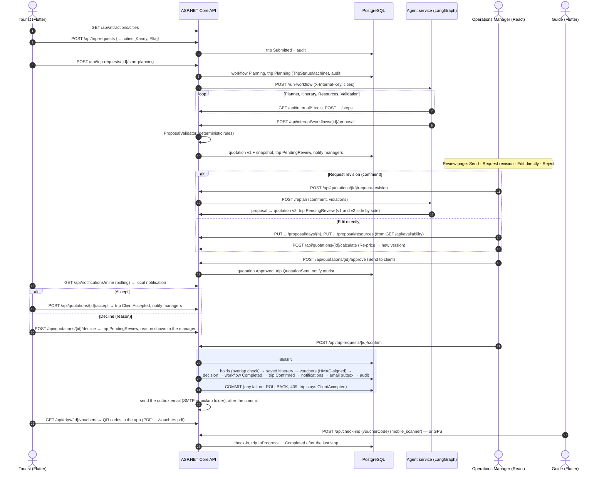

# The assessed workflow (PLAN.md section 6, v1.1 lifecycle)

The journey from the tourist's request to the finished tour. There are two human gates: the manager reviews the
proposal, and the tourist accepts the price. Nothing is held until the manager confirms an accepted quotation.

## Trip statuses

One C# class, `TripStatusMachine` (backend/src/TripCraft.Application/Trips/TripStatusMachine.cs), lists every
allowed move. Every endpoint changes a status through it, and an illegal move returns 409. Each change is written to
the trip history (audit_logs) with the actor and a reason.

A tourist may cancel until `CANCELLATION_CUTOFF_DAYS` (default 3) days before the start. After that, the app says
why cancellation is closed and offers the operator contact. A manager can cancel at any time.

## Sequence

**Safe-failure path:** with budget USD 400, Validation finds `OVER_BUDGET`. That is a Soft rule, so the trip is in
PendingReview with a warning, and "Send to client" stays disabled. The manager then requests a revision (the
Planner re-plans with the budget hotel tier) or edits and re-prices. A Hard rule or an agent error ends the trip in
`FailedSafely`, and the tourist can press "Try again".
