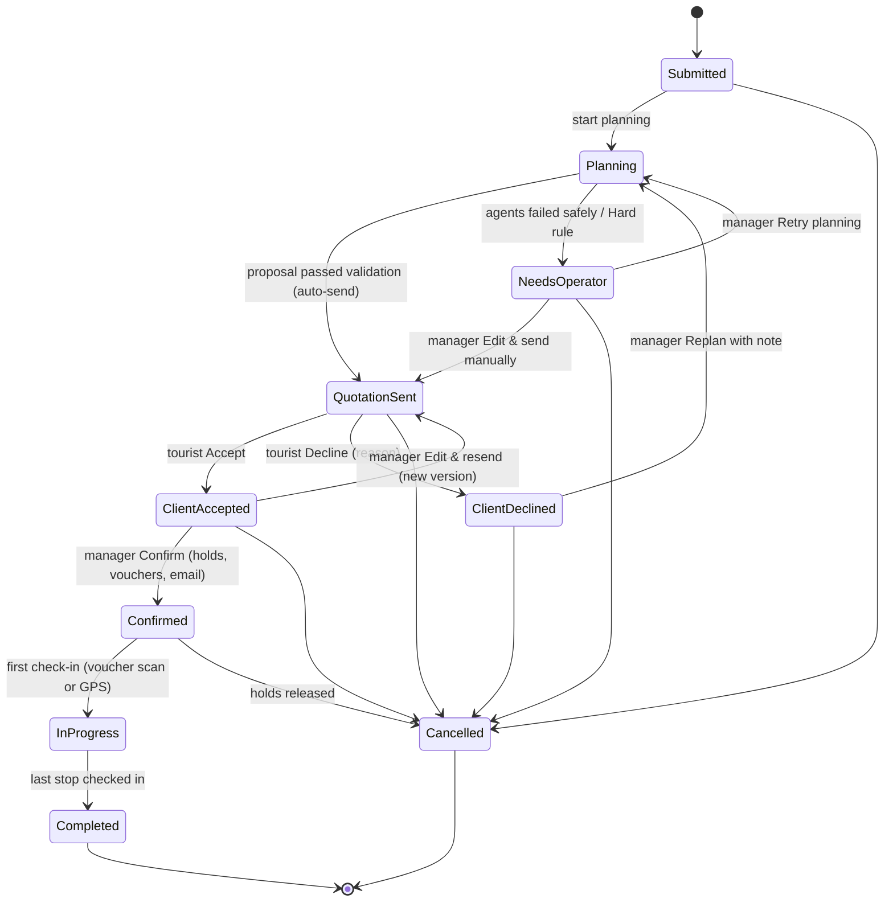
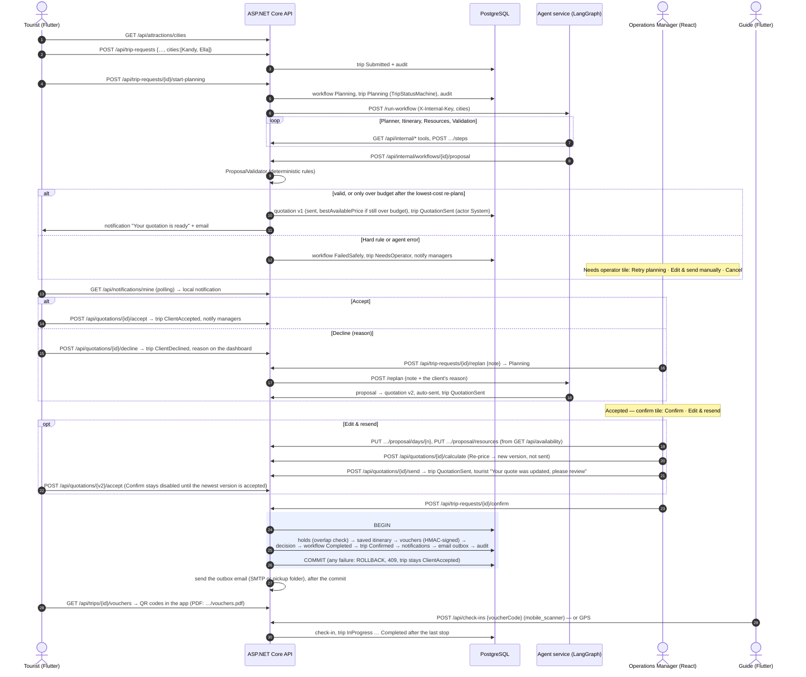

# The assessed workflow (PLAN.md section 6, v1.1 lifecycle)

The journey from the tourist's request to the finished tour. Quotations go straight to the client: no operator sits
between the agents and the tourist. **The human approval gate is Confirm.** An Operations Manager confirms a
quotation the client accepted, and only then are guide, vehicle and rooms held. Confirm is a manager-only action in
React.

## Trip statuses

One C# class, `TripStatusMachine` (backend/src/TripCraft.Application/Trips/TripStatusMachine.cs), lists every
allowed move. Every endpoint changes a status through it, and an illegal move returns 409. Each change is written to
the trip history (audit_logs) with the actor and a reason. The automatic send is recorded with the actor `System`.

The tourist's timeline in the app shows the main path: Submitted, Planning, Quotation sent, Accepted, Confirmed,
In progress, Completed. ClientDeclined, NeedsOperator and Cancelled are shown as side states with a "what's next"
line.

A tourist may cancel until `CANCELLATION_CUTOFF_DAYS` (default 3) days before the start. After that, the app says
why cancellation is closed and offers the operator contact. A manager can cancel at any time.

## Sequence

**Budget rule:** with budget USD 400, Validation finds `OVER_BUDGET` (a Soft rule). The Planner re-plans with the
`lowest` cost strategy (budget rooms, the cheapest eligible guide and vehicle, fewer paid entries) up to
`MAX_REPLANS`. If the total is still over the budget, the quotation is sent anyway with
`bestAvailablePrice = true` and the sentence "Best price we can offer — USD X above your budget".

**Safe-failure path:** a Hard rule or an agent error never sends a quote. The trip becomes `NeedsOperator`, the
error summary is shown on the dashboard, and a manager chooses Retry planning, Edit & send manually, or Cancel.
